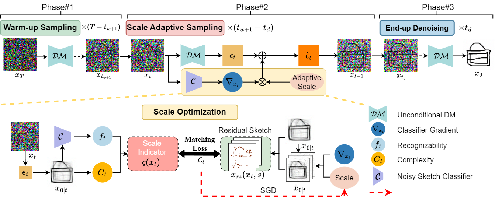
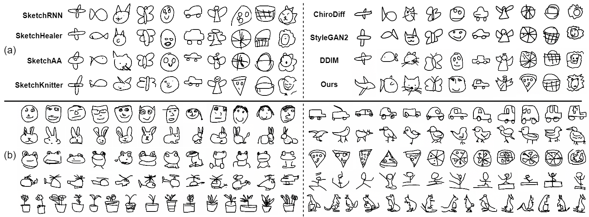

<p align="center">

  <h2 align="center">Scale-Adaptive Diffusion Model for Complex Sketch Synthesis</h2>
  <p align="center">
    <a href="https://openreview.net/profile?id=~Jijin_Hu1"><strong>Jijin Hu</strong></a>
    ·
    <a href="https://scholar.google.com/citations?user=KZOFaz4AAAAJ&hl=zh-CN&oi=sra"><strong>Ke Li</strong></a>
    ·
    <a href="https://scholar.google.com/citations?user=pQNpf7cAAAAJ&hl=zh-CN&oi=sra"><strong>Yonggang Qi</strong></a>
    ·
    <a href="https://scholar.google.com/citations?user=irZFP_AAAAAJ&hl=zh-CN&oi=sra"><strong>Yi-Zhe Song</strong></a>
    <br>
    <b>Beijing University of Posts and Telecommunications &nbsp; | &nbsp;  SketchX, CVSSP, University of Surrey </b>
  </p>
  <h3>
  <p align="center">
    [<a href="https://openreview.net/pdf?id=1ROAstc9jv"(https://openreview.net/pdf?id=5xadJmgwix)">OpenReview</a>]
  </p>
  </h3>
  
  <table align="center">
    <tr>
    <td>
      
    </td>
    </tr>
  </table>

## News
* **[2024.06.16]** Release training and inference code, checkpoints.

## Installaiton
```bash
conda env create -f environment.yml
conda activate ada_guidance
```

## Download Checkpoints
Here are the download links for each model checkpoint:
* 64x64 unconditional diffusion: [64x64_uncond_diffusion.pt](https://drive.google.com/file/d/1aK8OILBTxyA-KBCwZK7kdePnG1YEYjui/view?usp=sharing)
* 64x64 classifier: [64x64_classifier.pt](https://drive.google.com/file/d/1PElBL0dVH98_3Kh3-ehN4SdEfTtaDJXM/view?usp=drive_link)


## Inference
  For sampling from the 64x64 classifier-guided diffusion model with adaptive guidance scale, 250 step DDIM:
  ```bash
  sh classifier_sample.sh
  ```

## Training Models
train unconditional diffusion models:
  ```bash
  sh diffusion_train.sh
  ```
train a noised classifier:
  ```bash
  sh classifier_train.sh
  ```
## Results
Quantitative comparison results on <i>QuickDraw</i> Dataset. The best and second best are color-coded in <span style="color: red;">red</span> and <span style="color: blue;">blue</span>, respectively.
<table>
  <tr>
    <th rowspan="2"><b>Model</b></th>
    <th colspan="5"><b>Random 30 Categories</b></th>
    <th colspan="3"><b>345 Categories</b></th>
  </tr>
  <tr>
    <th>FID&darr;</th>
    <th>CLIP-Score&uarr;</th>
    <th>CLIP-Fine(%)&uarr;</th>
    <th>Prec&uarr;</th>
    <th>Rec&uarr;</th>
    <th>FID&darr;</th>
    <th>Prec&uarr;</th>
    <th>Rec&uarr;</th>
  </tr>
  <tr>
    <td><a href="https://github.com/magenta/magenta/tree/main/magenta/models/sketch_rnn" target="_blank">SketchRNN</td>
    <td>8.15</td>
    <td>0.59</td>
    <td>52.67</td>
    <td>0.37</td>
    <td>0.22</td>
    <td>10.32</td>
    <td>0.26</td>
    <td>0.24</td>
  </tr>
  <tr>
    <td><a href="https://github.com/sgybupt/SketchHealer" target="_blank">SketchHealer</td>
    <td>5.85</td>
    <td>0.63</td>
    <td>51.51</td>
    <td>0.67</td>
    <td>0.12</td>
    <td>--</td>
    <td>--</td>
    <td>--</td>
  </tr>
  <tr>
    <td><a href="https://openaccess.thecvf.com/content/ICCV2021/papers/Yang_SketchAA_Abstract_Representation_for_Abstract_Sketches_ICCV_2021_paper.pdf" target="_blank">SketchAA</td>
    <td>5.98</td>
    <td>0.59</td>
    <td>50.41</td>
    <td>0.51</td>
    <td>0.17</td>
    <td>--</td>
    <td>--</td>
    <td>--</td>
  </tr>
  <tr>
    <td><a href="https://github.com/wangqiang9/SketchKnitter/tree/main" target="_blank">SketchKnitter</td>
    <td>7.05</td>
    <td>0.55</td>
    <td>43.15</td>
    <td>0.41</td>
    <td>0.19</td>
    <td>--</td>
    <td>--</td>
    <td>--</td>
  </tr>
  <tr>
    <td><a href="https://github.com/dasayan05/chirodiff" target="_blank">ChiroDiff</td>
    <td>4.75</td>
    <td>0.59</td>
    <td>53.16</td>
    <td>0.64</td>
    <td>0.18</td>
    <td>3.17</td>
    <td>0.58</td>
    <td>0.25</td>
  </tr>
  <tr>
    <td><a href="https://github.com/NVlabs/stylegan2-ada-pytorch" target="_blank">StyleGAN2</td>
    <td>4.12</td>
    <td>0.67</td>
    <td>53.39</td>
    <td>0.55</td>
    <td>0.24</td>
    <td>2.93</td>
    <td>0.63</td>
    <td>0.27</td>
  </tr>
  <tr>
    <td><a href="https://github.com/openai/guided-diffusion" target="_blank">DDIM</td>
    <td>4.08</td>
    <td>0.67</td>
    <td>54.19</td>
    <td><span style="color: red;">0.71</span></td>
    <td>0.30</td>
    <td>2.85</td>
    <td><span style="color: red;">0.74</span></td>
    <td>0.31</td>
  </tr>
  <tr>
    <td><a href="https://arxiv.org/pdf/2207.12598" target="_blank">CFDG</td>
    <td>3.75</td>
    <td>0.68</td>
    <td>54.86</td>
    <td>0.68</td>
    <td>0.32</td>
    <td>2.64</td>
    <td>0.73</td>
    <td>0.36</td>
  </tr>
  <tr>
    <td><b>Ours</b></td>
    <td><span style="color: red;">3.08</span></td>
    <td><span style="color: red;">0.68</span></td>
    <td><span style="color: red;">55.54</span></td>
    <td><span style="color: blue;">0.68</span></td>
    <td><span style="color: red;">0.35</span></td>
    <td><span style="color: red;">2.51</span></td>
    <td><span style="color: blue;">0.72</span></td>
    <td><span style="color: red;">0.39</span></td>
  </tr>
</table>



Figure (b) shows some of our results. For more detailed results, please see [our paper and supplementary materials](https://openreview.net/pdf?id=5xadJmgwix).

## Acknowledgements
This project is developped on the codebase of [guided-diffusion](https://github.com/openai/guided-diffusion). We  appreciate this great work! 


## Citation
If you find this codebase useful for your research, please use the following entry.
```BibTeX
@inproceedings{hu2023scale,
  title={Scale-Adaptive Diffusion Model for Complex Sketch Synthesis},
  author={Hu, Jijin and Li, Ke and Qi, Yonggang and Song, Yi-Zhe},
  booktitle={The Twelfth International Conference on Learning Representations},
  year={2023}
}
```
